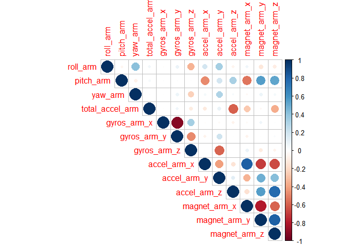
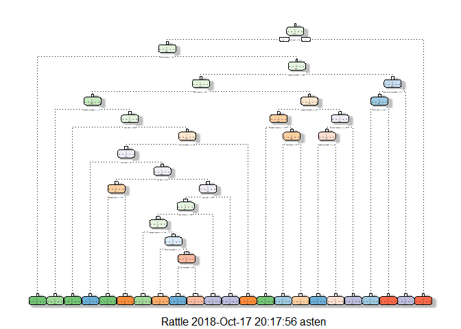

Background
----------

The ultimate goal of this project assignment is to predict the manner in
which people do particular physical exercise in their day today life. In
this project, data from accelerometers readings on the belt, forearm,
arm, and dumbell was used involving 6 different participants. Here 6
participants were allowed to wear accelerometers on different body parts
to lift weight and weight lifting exercises dataset investigated to see
"how (well)" an activity was performed by the wearer.

Load the project data
---------------------

    TrainingDataURL <- "http://d396qusza40orc.cloudfront.net/predmachlearn/pml-training.csv"
    TestingDataURL <- "http://d396qusza40orc.cloudfront.net/predmachlearn/pml-testing.csv"
    TrainingData <- read.csv(url(TrainingDataURL))
    TestingData <- read.csv(url(TestingDataURL))

Explore the project data
------------------------

#### Diamensions of Project datasets

    dim(TrainingData)

    ## [1] 19622   160

    dim(TestingData)

    ## [1]  20 160

#### Visualize the structure of the project data (TrainingData)

    str(TrainingData, list.len= 10)

    ## 'data.frame':    19622 obs. of  160 variables:
    ##  $ X                       : int  1 2 3 4 5 6 7 8 9 10 ...
    ##  $ user_name               : Factor w/ 6 levels "adelmo","carlitos",..: 2 2 2 2 2 2 2 2 2 2 ...
    ##  $ raw_timestamp_part_1    : int  1323084231 1323084231 1323084231 1323084232 1323084232 1323084232 1323084232 1323084232 1323084232 1323084232 ...
    ##  $ raw_timestamp_part_2    : int  788290 808298 820366 120339 196328 304277 368296 440390 484323 484434 ...
    ##  $ cvtd_timestamp          : Factor w/ 20 levels "02/12/2011 13:32",..: 9 9 9 9 9 9 9 9 9 9 ...
    ##  $ new_window              : Factor w/ 2 levels "no","yes": 1 1 1 1 1 1 1 1 1 1 ...
    ##  $ num_window              : int  11 11 11 12 12 12 12 12 12 12 ...
    ##  $ roll_belt               : num  1.41 1.41 1.42 1.48 1.48 1.45 1.42 1.42 1.43 1.45 ...
    ##  $ pitch_belt              : num  8.07 8.07 8.07 8.05 8.07 8.06 8.09 8.13 8.16 8.17 ...
    ##  $ yaw_belt                : num  -94.4 -94.4 -94.4 -94.4 -94.4 -94.4 -94.4 -94.4 -94.4 -94.4 ...
    ##   [list output truncated]

#### Remove null and empty values and clean project data

    Null_Columns <- which(colSums(is.na(TrainingData) |TrainingData=="")>0.95*dim(TrainingData)[1]) 
    TrainingData <- TrainingData[,-Null_Columns]

#### Remove the first six columns sice it is general information

    TrainingData <- TrainingData[,-c(1,3:7)]

Partition the Project data into training and test sets
------------------------------------------------------

    set.seed(1324)
    TAB_inTrain<-createDataPartition(y=TrainingData$classe, p=0.7,list = FALSE)
    TAB_training<-TrainingData[TAB_inTrain,]
    TAB_testing <-TrainingData[-TAB_inTrain,] 

#### Plot correlation among 13 variables

    M <- cor(TAB_training[, 15:27])
    corrplot(M, type = "upper")

Model fitting using rpart (Recursive Partitioning and Regression Trees) and rf (random forest) methods
------------------------------------------------------------------------------------------------------

    Mod1 <-randomForest(classe ~ ., data = TAB_training, importance=TRUE)
    Mod2<-rpart(classe ~ ., data = TAB_training, method = "class")

Plotting/ The decision tree
---------------------------

    fancyRpartPlot(Mod2)

    ## Warning: labs do not fit even at cex 0.15, there may be some overplotting

Prediction with the fitted models
---------------------------------

    Pred1<-predict(Mod1, TAB_testing, type = "class")
    Pred2<-predict(Mod2, TAB_testing, type = "class" )

Confusion Matrix (Accuracy assessment)
--------------------------------------

    confusion_Matrix1 <- confusionMatrix(Pred1, TAB_testing$classe)
    confusion_Matrix1

    ## Confusion Matrix and Statistics
    ## 
    ##           Reference
    ## Prediction    A    B    C    D    E
    ##          A 1672    8    0    0    0
    ##          B    2 1128    7    0    0
    ##          C    0    3 1019   11    0
    ##          D    0    0    0  952    6
    ##          E    0    0    0    1 1076
    ## 
    ## Overall Statistics
    ##                                           
    ##                Accuracy : 0.9935          
    ##                  95% CI : (0.9911, 0.9954)
    ##     No Information Rate : 0.2845          
    ##     P-Value [Acc > NIR] : < 2.2e-16       
    ##                                           
    ##                   Kappa : 0.9918          
    ##  Mcnemar's Test P-Value : NA              
    ## 
    ## Statistics by Class:
    ## 
    ##                      Class: A Class: B Class: C Class: D Class: E
    ## Sensitivity            0.9988   0.9903   0.9932   0.9876   0.9945
    ## Specificity            0.9981   0.9981   0.9971   0.9988   0.9998
    ## Pos Pred Value         0.9952   0.9921   0.9864   0.9937   0.9991
    ## Neg Pred Value         0.9995   0.9977   0.9986   0.9976   0.9988
    ## Prevalence             0.2845   0.1935   0.1743   0.1638   0.1839
    ## Detection Rate         0.2841   0.1917   0.1732   0.1618   0.1828
    ## Detection Prevalence   0.2855   0.1932   0.1755   0.1628   0.1830
    ## Balanced Accuracy      0.9985   0.9942   0.9951   0.9932   0.9971

    confusion_Matrix2 <- confusionMatrix(Pred2, TAB_testing$classe)
    confusion_Matrix2

    ## Confusion Matrix and Statistics
    ## 
    ##           Reference
    ## Prediction    A    B    C    D    E
    ##          A 1516  253   19  105   79
    ##          B   29  578   40   19   50
    ##          C   43  115  839  151  122
    ##          D   59   89   63  594   55
    ##          E   27  104   65   95  776
    ## 
    ## Overall Statistics
    ##                                           
    ##                Accuracy : 0.7312          
    ##                  95% CI : (0.7197, 0.7425)
    ##     No Information Rate : 0.2845          
    ##     P-Value [Acc > NIR] : < 2.2e-16       
    ##                                           
    ##                   Kappa : 0.6581          
    ##  Mcnemar's Test P-Value : < 2.2e-16       
    ## 
    ## Statistics by Class:
    ## 
    ##                      Class: A Class: B Class: C Class: D Class: E
    ## Sensitivity            0.9056  0.50746   0.8177   0.6162   0.7172
    ## Specificity            0.8917  0.97092   0.9113   0.9459   0.9394
    ## Pos Pred Value         0.7688  0.80726   0.6606   0.6907   0.7273
    ## Neg Pred Value         0.9596  0.89147   0.9595   0.9264   0.9365
    ## Prevalence             0.2845  0.19354   0.1743   0.1638   0.1839
    ## Detection Rate         0.2576  0.09822   0.1426   0.1009   0.1319
    ## Detection Prevalence   0.3351  0.12167   0.2158   0.1461   0.1813
    ## Balanced Accuracy      0.8987  0.73919   0.8645   0.7811   0.8283

#### From the accuracy assessment we can see that Mod1 (Model 1) has better than Mod2 (Model 2) and can be taken as the best fit for predicting test samples.

Note that: Sensitivity, specificity or predictive values of a
measurement system compared to a reference results (the truth or a gold
standard). The measurement and "truth" data must have the same two
possible outcomes and one of the outcomes must be thought of as a
"positive" results. The sensitivity is defined as the proportion of
positive results out of the number of samples which were actually
positive. When there are no positive results, sensitivity is not defined
and a value of NA is returned. Similarly, when there are no negative
results, specificity is not defined and a value of NA is returned.
Similar statements are true for predictive values. The positive
predictive value is defined as the percent of predicted positives that
are actually positive while the negative predictive value is defined as
the percent of negative positives that are actually negative.

Validation of the model result/ Prediction
------------------------------------------

    Validation <- predict(Mod1, TestingData, type = "class")
    Validation

    ##  1  2  3  4  5  6  7  8  9 10 11 12 13 14 15 16 17 18 19 20 
    ##  B  A  B  A  A  E  D  B  A  A  B  C  B  A  E  E  A  B  B  B 
    ## Levels: A B C D E
